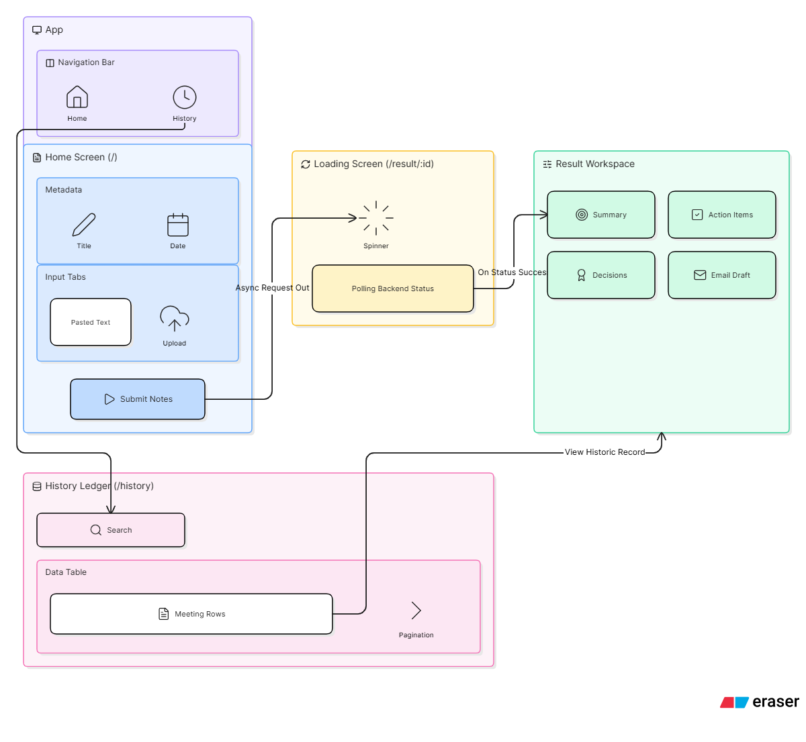

# System Architecture

The Meeting-to-Execution Assistant employs a decoupled, modern three-tier architecture ensuring high scalability, rapid AI iteration, and strict data integrity.

---

## 1. High-Level Topology

```text
[ Client Browser ] <---(REST API / JSON)---> [ FastAPI Backend ]
       |                                           |         |
 (Vercel CDN)                               (Render)        |
                                                   |         |
                                         [ Neon PostgreSQL ] [ Google Gemini API ]
```

---

## 2. Frontend Layer (React + Vite)

| Concern | Technology / Approach |
|---|---|
| **Framework** | React 18 initialized via Vite for ultra-fast Hot Module Replacement (HMR) |
| **Styling** | Tailwind CSS — utility-first, responsive, and consistent UI design |
| **Network Client** | Axios, configured with dynamic base URL sanitization to prevent duplicate path routing strings between local and production environments |
| **State Management** | React Hooks (`useState`, `useEffect`) managing localized component state, loading overlays, and pagination logic |

---

## 3. Backend API Layer (FastAPI)

| Concern | Technology / Approach |
|---|---|
| **Framework** | FastAPI — selected for native async capabilities, automatic Swagger doc generation, and strict typing |
| **Validation** | Pydantic models validate all incoming requests; invalid data (missing fields, wrong formats) is rejected at the perimeter with `422 Unprocessable Entity` |
| **Router Layout** | Endpoints compartmentalized via `APIRouter` to isolate submission logic from retrieval and deletion routines |

---

## 4. Data Layer (SQLAlchemy + Neon)

| Concern | Technology / Approach |
|---|---|
| **ORM** | SQLAlchemy maps Python objects to PostgreSQL relational tables |
| **Database** | Neon Serverless PostgreSQL — connection pooling prevents max-connection timeouts during high-traffic scaling |
| **Relational Integrity** | Core `Meeting` parent table branches into One-to-Many relationships with `ActionItem`, `Decision`, and `Blocker` tables; cascade delete enforced at the database level |

### Schema Overview

```
Meeting (parent)
├── ActionItem   (One-to-Many)
├── Decision     (One-to-Many)
└── Blocker      (One-to-Many)
```

---

## 5. AI Processing Pipeline (Google GenAI)

| Concern | Detail |
|---|---|
| **Model** | `gemini-2.5-flash` — high-speed, cost-effective text analysis |
| **Format Enforcement** | `response_mime_type="application/json"` forces the LLM to return strictly structured data |
| **Resilience** | Custom 3-attempt retry loop catching `APIError` and `JSONDecodeError`, with a strict 60-second processing timeout guard |

### Processing Flow

```text
Raw Transcript Input
        │
        ▼
┌───────────────────┐
│  Input Validation  │  ← Word count (50–10,000), filler text rejection
└────────┬──────────┘
         │
         ▼
┌───────────────────┐
│  Prompt Assembly   │  ← Structured prompt construction
└────────┬──────────┘
         │
         ▼
┌───────────────────┐
│  Gemini API Call   │  ← 3-attempt retry, 60s timeout
└────────┬──────────┘
         │
         ▼
┌───────────────────┐
│  JSON Parsing &    │  ← Pydantic validation
│  Pydantic Validate │
└────────┬──────────┘
         │
         ▼
┌───────────────────┐
│  Persist to DB     │  ← SQLAlchemy → Neon PostgreSQL
└───────────────────┘
```

---

## 6. Deployment Architecture

| Service | Platform | Role |
|---|---|---|
| **Frontend** | Vercel (CDN) | Static asset hosting, global edge delivery |
| **Backend API** | Render | Containerised FastAPI web service |
| **Database** | Neon | Serverless PostgreSQL with connection pooling |
| **AI** | Google AI Studio | Gemini 2.5 Flash API |